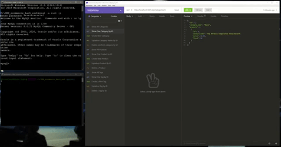

# E-commerce Back End  
  
 ## Table of Contents:  
[1. Description](#Description)  
[2. Installation](#Installation)  
[3. Acceptance Criteria](#Acceptance-Criteria)  
[4. License Details](#License-Details)  
[5. Submission](#Submission)   
[6. Questions](#Questions)  
## Description:
This is the back end for an e-commerce site.
## Demo


## Installation:
This repo is not to be deployed, if you wanted to, you could by doing the following:  
1. Download the repo files from the link below
2. Run the following at the command line
```
    - npm init -y.  
    - npm install express sequelize mysql2
    - npm install dotenv
    - npm i nodemon.
```
3. Log into mysql using 
```
    $ mysql -u root -p
```
4. At the mysql command prompt run the following commands:
```
    - mysql> source db/schema.sql;
    -  mysql> use ecommerce_db;  
```
5. Go to the terminal and enter the following:
```
     - npm run seed
     - npm seed
```


## Acceptance Criteria:
- I am able to connect to a database using Sequelize by adding my database name, MySQL username, and MySQL password to an environment variable file

- When I enter schema and seed commands a development database is created and is seeded with test data

- When I enter the command to invoke the application, the server is starts and the Sequelize models are synced to the MySQL database

- When I open API GET routes in Insomnia for categories, products, or tags, the data for each of these routes is displayed in a formatted JSON

- When I open API GET routes in Insomnia for a single category, product, or tag, the data for that category, product, or tag is displayed in a formatted JSON

- When I test API POST, PUT, and DELETE routes in Insomnia, I am able to successfully create, update, and delete data in my database

## License Details: 
 This project is under no license.  

## Submission:
 [Github repository](https://github.com/civ187/ORM_ecommerce_back_end)

 [Walktrhough Video](https://youtu.be/qcNyxNS5JX4)


## Tests:
Tested restful API calls with insomnia

## Questions:
 Here is a link to my github:  
https://github.com/civ187  
 Email me at:  
civ187@gmail.com  
for additional questions
